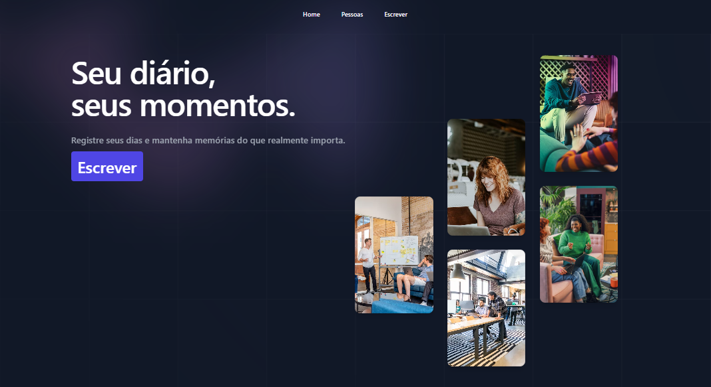

# psw-returnal-project-2
🪂 Diário online Full-Stack com Python e Django | Projeto 2
<p>
  
  
  
  <a href="https://opensource.org/licenses/MIT">
    
  </a>
</p>

## Tópicos

[Sobre o Projeto](#sobre-o-projeto)

[Tecnologias](#tecnologias)

[Instalação e Uso](#instalação-e-uso)

[Licença](#licença)

<br>

## Sobre o Projeto

Este projeto foi desenvolvido durante a Semana do Canal Pythonando, sendo o segundo de uma série de três projetos criados, Este projeto foi desenvolvido para gerenciar um diário online utilizando Python e Django. O objetivo é permitir que os usuários registrem suas atividades diárias de forma organizada, podendo criar, editar, listar e excluir entradas no diário, além de visualizar um histórico de registros. O projeto utiliza Django como framework principal para o desenvolvimento da aplicação web e foi pensado para fornecer uma interface simples e intuitiva para os usuários.

<p align="center">
  
</p>

<br>

## Tecnologias

As seguintes tecnologias foram utilizadas no desenvolvimento do projeto:

- [Python](https://www.python.org/)
- [Django](https://www.djangoproject.com/)
- [Pillow](https://python-pillow.org/) (para manipulação de imagens)
- [SQLite](https://www.sqlite.org/index.html) (banco de dados padrão para desenvolvimento com Django)

<br>

## Instalação e Uso

### Pré-requisitos

Antes de começar, você precisa ter o Python 3.x instalado no seu sistema. Você pode baixar o Python [aqui](https://www.python.org/downloads/).

### Passos para Configuração e Execução

1. **Clone o repositório**:

  Abra seu terminal e clone o repositório do projeto:

  ```bash
  git clone https://github.com/yMiguelzin/diario-online-fullstack.git

  ```
2. **Ative o ambiente virtual (opcional, mas recomendado)**:

  Navegue até a pasta do projeto e crie/ative um ambiente virtual:

  ```bash
  Copiar código
  
  # Criar
    
  #Linux
  python3 -m venv venv
    
  #Windows
  python -m venv venv
  ```

<br>

Após a criação do venv vamos ativa-lo:

  ```bash
  #Ativar
  #
  - Linux
  source venv/bin/activate
  
  #
  - Windows
  venv\Scripts\Activate

  # Caso algum comando retorne um erro de permissão execute o código e tente novamente:
  Set-ExecutionPolicy -Scope CurrentUser -ExecutionPolicy RemoteSigned

  ```

3. **Instale as dependências**:

  Navegue até a pasta do projeto e instale as dependências necessárias:

  ```bash
  pip install django
  pip install pillow

  ```

4. **Configuração do Banco de Dados**:

  Agora, configure o banco de dados. Execute os comandos abaixo para criar as migrações necessárias e aplicá-las ao banco de dados:
  
  ```bash
  python manage.py makemigrations
  python manage.py migrate

  ```
5. **Execute o Servidor Django**:

  Inicie o servidor de desenvolvimento para rodar a aplicação localmente:
  
  ```bash
  python manage.py runserver
  O servidor será executado em http://localhost:8000/diario/
  Abra esse endereço no seu navegador para começar a usar a aplicação.
  
  ```

  <br>
  
## Licença
<a href="https://opensource.org/licenses/MIT">
    
</a>

<br>

Esse projeto está sob a licença MIT. Veja o arquivo [LICENSE](/LICENSE) para mais detalhes.

---

Feito com 💚 por [Miguel Preto](https://github.com/yMiguelzin)

